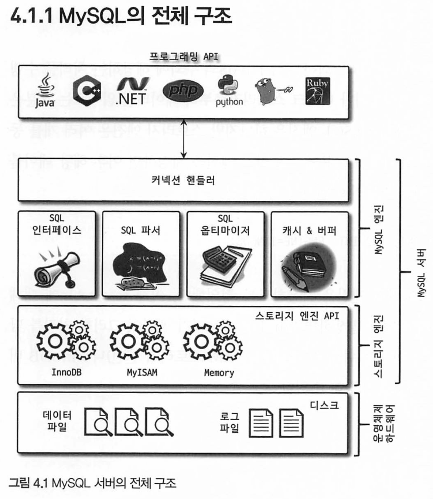
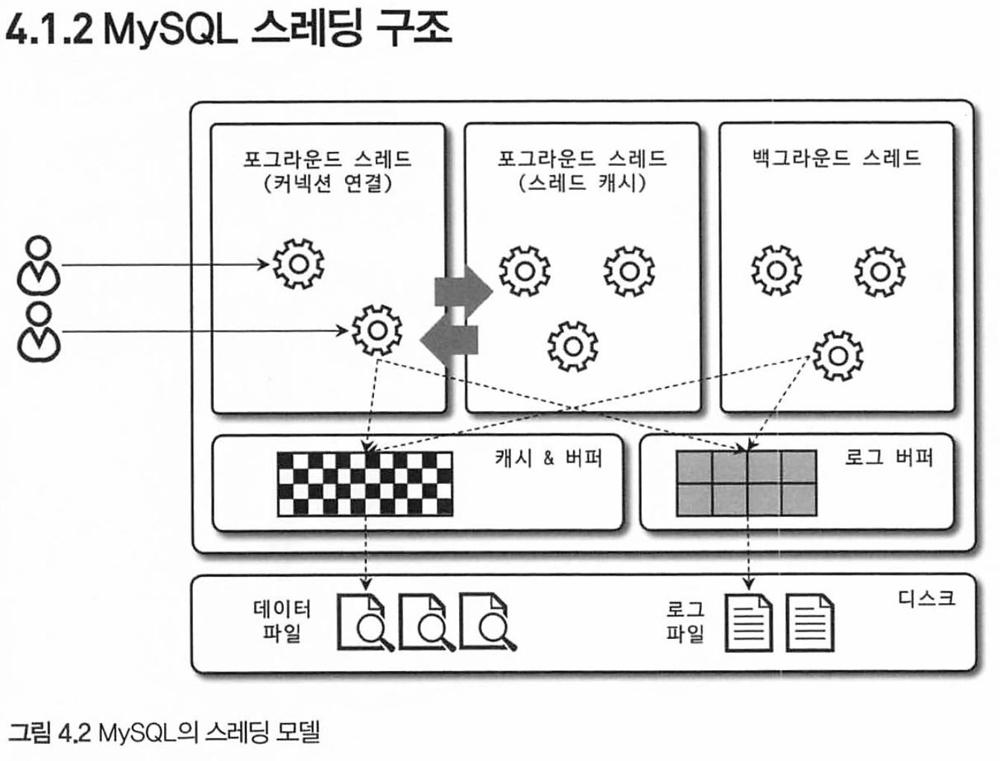
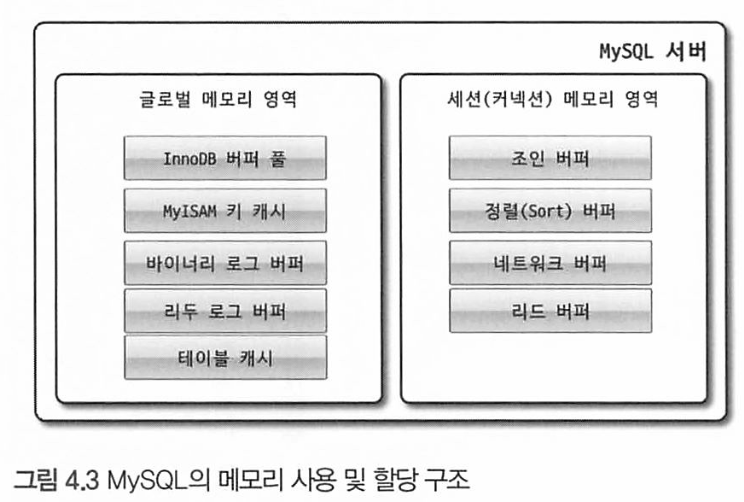
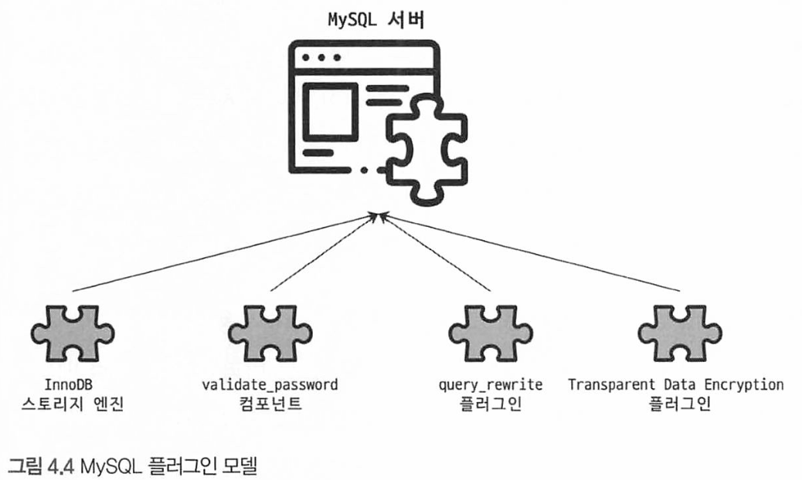
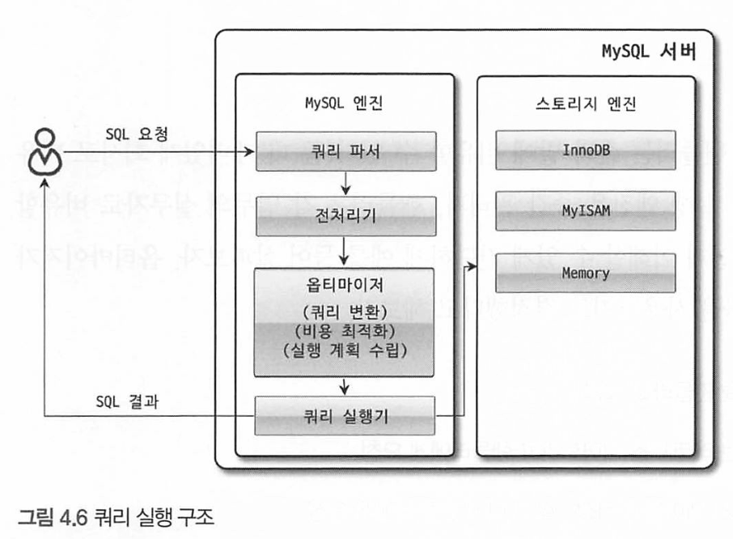

# 들어가기 전에

MySQL 서버는 머리 역할의 **MySQL 엔진**과 손발 역할의 **스토리지 엔진**으로 이루어짐

⚠️ 스토리지 엔진은 핸들러 API 스펙만 만족하면 개인이 직접 구현해 사용할 수 있고 기본으로 **InnoDB, MyISAM 스토리지 엔진을 제공**함

# MySQL 엔진 아키텍처

### MySQL의 전체 구조



**MySQL 서버 = MySQL 엔진 + 스토리지 엔진**

`MySQL 엔진` 

- 클라이언트로부터의 접속, 쿼리 요청을 처리 (커넥션 핸들러)
- SQL 파싱 (SQL 파서)
- SQL의 권한 등의 적합성 파악 (전처리기)
- 최적화된 쿼리 실행 준비 (SQL 옵티마이저)

`스토리지 엔진`

- MySQL 엔진이 요청된 SQL 문장을 분석, 최적화하는 반면, 스토리지 엔진은 실제 데이터를 디스크 스토리지에 저장, 조회
- 1개만 존재하는 MySQL 엔진과 달리 **여러 개의 스토리지 엔진을 동시에 사용**할 수 있음

```SQL
CREATE TABLE test_table (fd1 INT, fd2 INT) ENGINE=INNODB;
```

`핸들러 API`

- MySQL 엔진에서 데이터 저장 및 조회를 스토리지 엔진에 요청하기 위한 API

### MySQL 스레딩 구조




MySQL 서버는 프로세스 기반이 아닌 스레드 기반으로 동작하며 Foreground와 Background 스레드로 구분

커넥션별로 Foreground 스레드가 하나씩 생성됨

#### Foreground 스레드

- 최소한 MySQL 서버에 접속된 클라이언트의 수만큼 존재
- 각 클라이언트 사용자가 요청하는 쿼리 문장을 처리
- 커넥션이 종료되면 해당 커넥션을 담당하던 스레드는 **스레드 캐시**로 되돌아감
  - 이미 스레드 캐시에 일정 개수 이상의 대기중인 스레드가 있으면 캐시로 넣지 않고 그대로 스레드를 종료
- 데이터를 데이터 버퍼나 캐시로부터 가져오며 없는 경우 디스크의 데이터 파일에 접근해 데이터를 읽어옴
  - MyISAM 스토리지 엔진은 디스크 쓰기 작업까지 Foreground 스레드가 처리
  - InnoDB 스토리지 엔진은 데이터 버퍼, 캐시까지만 Foreground 스레드가 처리하고 버퍼로부터 디스크에 기록하는 작업은 Background

#### Background 스레드

InnoDB는 여러 작업을 백그라운드 스레드에서 처리

- 인서트 버퍼를 병합하는 스레드
- **로그를 디스크에 기록하는 스레드**
- **InnoDB 버퍼 풀의 데이터를 디스크에 기록하는 스레드**

- 데이터를 버퍼로 읽어 오는 스레드
- 잠금이나 데드락을 모니터링하는 스레드

사용자의 요청을 처리하는 도중 데이터의 **쓰기**작업은 지연되어 처리될 수 있지만 읽기 작업은 지연될 수 없다.

- 상용 DBMS에는 대부분 쓰기 작업을 일괄 처리하는 기능이 탑재됨 (InnoDB 포함)
- MyISAM은 그렇지 않고 사용자 쓰레드(Foreground)가 쓰기 작업까지 함께 처리하도록 설계
  - 쓰기 버퍼링 기능을 사용할 수 없어 디스크에 쓰기가 완료될 때까지 쿼리가 완료되지 않음

### 메모리 할당 및 사용 구조




MySQL에서 사용하는 메모리 공간은 **글로벌과 로컬 메모리 영역**으로 구분

`글로벌 메모리 영역` : MySQL 서버가 시작되면서 OS로부터 할당, 시스템 변수로 설정해둔 만큼 OS로부터 메모리 할당받음

`로컬 메모리 영역` : 클라이언트 스레드(Foreground)가 쿼리를 처리하는데 사용하는 메모리 영역

#### 글로벌 메모리 영역

클라이언트 스레드의 수와 무관하게 하나의 메모리 공간만 할당(일반적)

글로벌 영억을 N개 할당할 수도 있지만 모든 스레드에 의해 공유됨

- 테이블 캐시
- InnoDB 버퍼 풀
- InnoDB 어댑티브 해시 인덱스
- InnoDB 리두 로그 버퍼

#### 로컬 메모리 영역

클라이언트 스레드가 쿼리를. 처리하는 데 사용하는 메모리 영역

로컬 메모리는 각 클라이언트 스레드별 독립적으로 할당되며 **서로 절대 공유되지 않음**

각 쿼리의 용도별로 필요할 때만 메모리 공간이 할당되고 필요하지 않은 경우 메모리 공간을 할당조차 하지 않을 수도 있음

> 커넥션이 열려 있는 동안 계속 할당된 상태로 남아 있는 공간(커넥션 버퍼, 결과 버퍼),
>
> 쿼리를 실행하는 순간에만 할당했다가 다시 해제하는 공간(소트 버퍼, 조인 버퍼)

- 정렬 버퍼
- 조인 버퍼
- 바이너리 로그 캐시
- 네트워크 버퍼

### 플러그인 스토리지 엔진 모델




플러그인 모델은 MySQL의 독특한 구조 중 하나 (8.0 부터는 사라짐)

스토리지 엔진 조차도 플러그인이기 때문에 사용하고자 하는 스토리지 엔진의 플러그인을 다운받아 사용할 수 있음

이외에도 **인증, Full Text Search Parser, 쿼리 재작성** 등의 플러그인이 있음

### 컴포넌트

MySQL 8.0부터 **플러그인 아키텍처를 대체**하기 위해 나온 **컴포넌트 아키텍처**

플러그인의 단점들을 보완

- 플러그인은 MySQL 서버와 인터페이스할 수 있고 플러그인끼리는 통신 불가
- MySQL 서버의 변수나 함수를 직접 호출하기 때문에 캡슐화되지 않아 안전하지 않음
- 상호 의존 관계를 설정할 수 없어서 초기화가 어려움

전 장에서 봤지만 `INSTALL COMPONENT 'file://component_validate_password';`를 통해 컴포넌트 설치

### 쿼리 실행 구조



쿼리 실행 구조를 알아보자

#### 쿼리 파서

사용자의 쿼리 문장을 MySQL이 인식할 수 있는 최소 단위의 어휘인 **토큰**으로 분리해 트리 형태의 구조(파서 트리)로 만들어 내는 과정

#### 전처리기

파서 트리를 기반으로 쿼리 문장의 **구조적인 문제점**을 확인하고 해당 **객체 존재 여부**와 **접근 권한** 등을 확인

#### 옵티마이저

쿼리 문장을 저렴한 비용으로 가장 빠르게 처리하는 방법을 결정

#### 실행 엔진

옵티마이저에서 만들어진 계획대로 핸들러에게 요청

#### 핸들러

MySQL 서버의 가장 밑단에서 실행 엔진의 요청에 따라 데이터를 디스크에 저장, 조회하는 역할 담당

핸들러 = 스토리지 엔진

### 복제

추후 기술

### 쿼리 캐시

SQL의 실행 결과를 메모리에 캐시하고 동일 SQL이 들어왔을 때 재실행하는 것이 아닌 캐시에서 결과를 조회해 빠른 성능

테이블의 데이터가 변경되면 캐시 내의 해당 테이블에 연관된 데이터들을 모두 삭제해야했고 이는 심각한 **동시 처리 성능 저하**

MySQL 8.0부터 쿼리 캐시 기능은 제거됨

### 스레드 풀

내부적으로 사용자의 요청을 처리하는 스레드 수를 제한해 동시 처리되는 요청이 많더라도 CPU가 제한된 개수의 스레드 처리에만 집중할 수 있게해서 서버의 자원 소모를 줄임

MySQL 커뮤니티 버전은 스레드 풀을 제공하지 않지만 Percona Server 플러그인을 사용하면 기본적으로 CPU 코어 개수만큼 스레드 그룹 생성

모든 스레드가 일을 처리하고 있으면 해당 스레드 그룹에 새로운 작업 스레드를 생성하여 추가할 지, 기존 스레드들이 처리 완료할 때까지 기다릴지 여부를 판단해야 함

> 스레드 풀의 타이머 스레드는 주기적으로 스레드 그룹의 상태를 체크해  
>
> `thread_pool_stall_limit`(ms) 만큼 작업 스레드가 지금 처리중인 작업을 끝내지 못하면 새로운 스레드를 생성해 스레드 그룹에 추가(thread_pool_stall_limit 시간만큼 기다리게 됨)
>
> 단, 전체 스레드 개수는 시스템 변수에 설정된 개수를 넘어설 수 없음.(thread_pool_max_threads)

### 트랜잭션 지원 메타데이터

5.7버전까지 테이블의 구조 정보, 스토어드 프로그램 정보(데이터 딕셔녀리 or 메타데이터)를 파일 기반으로 관리했음

이 때문에, 중간에 테이블이 예기치 않은 서버 종료로 인해 깨지는 현상이 발생

MySQL 8.0부터 InnoDB 테이블에 데이터 딕셔너리들을 관리하도록 해서 트랜잭션이 보장됨

하지만, 여전히 InnoDB를 제외한 스토리지 엔진을 사용하는 테이블들은 트랜잭션이 보장되지 않고 파일 관리함

## 생각해 볼점

1. Hikari CP 같은 커넥션 풀과 MySQL의 스레드 풀의 관계
