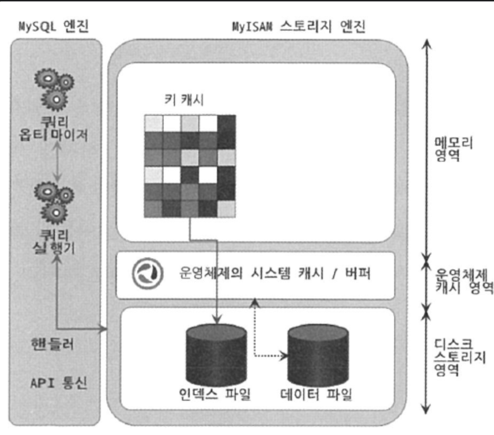

# 4.3 MyISAM 스토리지 엔진 아키텍처




## 키 캐시

InnoDB의 버퍼 풀과 비슷한 역할을 하는것이 MyISAM의 키 캐시(또는 키 버퍼)다.

키 캐시는 인덱스 만을 대상으로 작동하며, 인덱스의 디스크 쓰기 작업에 대해서만 부분적으로 버퍼링 역할을 한다.

메뉴얼에서는 일반적으로 키 캐시의 히트율 (키 캐시 이용 쿼리)를 99% 이상으로 유지하라고 권장한다.

히트율이 99% 미만이라면 키 캐시를 더 크게 설정하는것이 좋다. 

제한 값 이상의 키 캐시를 할당하고 싶다면 기본(Default) 키 캐시 이외에 별도의 명명된 키 캐시 공간을 설정해야 한다

기본 키 캐시 공간을 설정하는 파라미터는 key_buffer_size다

```
key_buffer_size = 4GB
kbuf_board.key_buffer_size = 2GB
kbuf_comment.key_buffer_size = 2GB
```

* 기본 키 캐시 4GB
* kbuf_board, kbuf_comment 키 캐시 2GB

기본 키 캐시 이외의 명명된 키 캐시 영역 (위 예에서는 kbuf_board.key_buffer_size, kbuf_comment.key_buffer_size )에서 어떤 인덱스를 캐시할지 MyISAM한테 알려주지 않으면 사용하지 않으므로 주의하자

```mysql
// board 테이블에 kbuf_board 키 캐시 사용 지정
mysql> CACHE INDEX db1.board, db2.board IN kbuf_board;
// board 테이블에 kbuf_comment 키 캐시 사용 지정
mysql> CACHE INDEX db1.comment, db2.comment IN kbuf_comment;
```

* 키 캐시에 대한 더 자세한 설명은 https://dev.mysql.com/doc/refman/8.0/en/multiple-key-caches.html

## 운영체제의 캐시 및 버퍼

MyISAM 테이블 데이터 (즉, row)에 대해서는 캐시/버퍼링 기능이 존재하지 않는다

때문에 데이터 읽기/쓰기 작업은 항상 OS 디스크 읽기/쓰기 작업으로 요청이 된다.

대부분의 OS에는 자체 캐시/버퍼링 기능이 존재하여 MyISAM 성능은 OS 기능에 의존성이 높다

OS 캐시는 애플리케이션들이 사용하고 남은 메모리 공간을 캐시로 사용하므로 MyISAM을 사용할때는 항상 OS 메모리 공간을 예의주시해야한다


일반적으로 키 캐시는 최대 물리 메모리의 40% 이상을 넘지 않게 설정하는것이 좋다.


## 데이터 파일과 프라이머리 키(인덱스) 구조

InnoDB는 프라이머리키에 의한 클러스터링 되어 저장되는 반면

MyISAM은 프라이머리 키에 대한 클러스터링 없이 데이터 파일이 힙 공간처럼 활용되어 INSERT 되는 순서대로 데이터 파일에 저장된다.

MyISAM 테이블에 저장되는 **레코드는** 모두 ROWID라는 물리적인 주솟값을 가지는데, 프라이머리키와 세컨더리 인덱스는 모두 데이터 파일에 저장된 레코드의 ROWID 값을 포인터로 가진다.

MyISAM의 테이블에서 ROWID는 가변길이 / 고정길이 방식으로 저장 가능하다 

 

# MySQL 로그 파일

MySQL 서버에 문제가 생겼을 때는 다음에 설명하는 로그 파일들을 자세히 확인하는 습관을 들일 필요가 있다.


## 에러 로그 파일

MySQL이 실행되는 도중 발생하는 에러나 경고 메시지가 출력되는 로그 파일이다

* 위치 : MySQL 설정 파일(my.cnf) 에서 log_error라는 이름의 파라미터로 정의된 경로에 생성된다.

설정 파일에 별도로 정의되지 않은 경우에는 데이터 디렉터리(datadir 파라미터에 설정된 디렉터리 )에 .err 라는 확장자로 붙은 파일로 생성된다. 

```mysql
--// 다음의 명령어로 확인 가능

SHOW VARIABLES LIKE 'datadir';

--// my.cnf 파일을 열어 다음과 같은 항목을 확인해봐도 된다
datadir=/var/lib/mysql
```


### MySQL 시작하는 과정과 관련된 정보성 및 에러 메시지

mysql 서버가 정상적으로 기동하면 'mysqld: ready for connections' 메시지를 확인할 수 있다 

변수명을 인식하지 못하거나 파라미터 값 설정을 못한 경우 에러메시지를 출력하고 시작하지 못했다는 메시지를 보여준다. 

ex)

```
ERROR 1193 (HY000): Unknown system variable 'invalid_variable'
```


### 마지막으로 종료할 때 비정상적으로 종료된 경우 나타나는 InnoDB 트랜잭션 복구 메시지

4.2.6절 자동화된 복구 참조하거나 MySQL 메뉴얼 참조 

* https://dev.mysql.com/doc/refman/8.0/en/innodb-recovery.html

### 쿼리 처리 도중에 발생하는 문제에 대한 에러 메시지

쿼리 실행 도중 발생한 에러나 복제에서 문제가 될만한 쿼리에 대한 경고 메시지는 에러 로그에 기록된다.

ex)

````
/var/log/mysql/error.log
````

* 또는 위에서 설정된 에러로그 위치

### 비정상적으로 종료된 커넥션 메시지 (Aborted Connection)

클라이언트 애플리케이션에서 정상적으로 접속 종료를 하지 못하고 프로그램이 종료된 경우 에러 로그 파일에 이런 내용이 기록된다.

```
2023-07-01T10:30:15.123456Z 145 [Note] Aborted connection 1234567 to db_name_user: 'user_name'@'host_name' (Got an error reading communication packets)
```


max_connect_errors 시스템 변숫값이 너무 낮게 설정된 경우 클라이언트 프로그램이 "Host 'host_name' is blocked" 라는 에러가 발생할 수도 있다.

이경우 max_connect_errors 시스템 변수 값을 증가시키면 된다


### InnoDB 모니터링 또는 상태 조회 명령(SHOW ENGINE INNODB SATUS) 

테이블 모니터링이나 락 모니터링, 또는 InnoDB 엔진 상태를 조회하는 명령이다. 

```mysql
mysql> SHOW ENGINE INNODB SATUS
```

InnoDB 모니터링을 활성화 상태로 만들어 두고, 그대로 유지하는 경우에는 에러 로그 파일이 매우 커지므로,

모니터링을 사용한 이후에는 다시 비활성화 해서 에러 로그 파일이 커지지 않게 만들어야 한다. 

어떻게 비활성화?

```mysql
mysql> SET GLOBAL innodb_status_output=OFF
```

또는 my.cnf 파일을 열어서 

```
[mysqld]
innodb_status_output=OFF
```

구성 파일을 저장하고 닫는다.


모니터링을 다시 활성화 해야 하는 경우 이와 반대로 `innodb_status_output` 값을 `ON`으로 설정하고 MySQL 서버를 재시작하면 된다.

### MySQL의 종료 메시지

아무도 모르게 종료돼거나 재시작 되는 경우, 에러 로그파일에서 확인할 수 있다.


* 누군가가 종료 시킨 경우 : Received SHUTDOWN from user ...

* 아무런 종료 메시지가 없거나 스택 트레이스 출력인 경우 세그먼테이션 폴트로 비정상 종료이다. 
  * 일반적으로 세그먼테이션 폴트는 메모리 관련 오류로 인해 프로그램이 예기치 않게 종료되는 상황

https://dev.mysql.com/doc/refman/8.0/en/error-log.html


### 제너럴 쿼리 로그 파일(제너럴 로그 파일, General log)

MySQL 서버에서 실행되는 쿼리들의 전체 목록을 뽑을 필요가 있따면, 쿼리 로그를 활성화 해서 쿼리를 로그 파일로 기록하면 된다.

* my.cnf 파일 접속 

```mysql
[mysql]
log_output=FILE
general_log=1
general_log_file=/path/to/query.log
```

* `/path/to/query.log`는 실제 로그 파일이 생성될 경로를 나타내는데, 사용자가 원하는 경로로 변경해야 한다. 

* 쿼리 로그를 사용한 후에는 필요한 정보를 얻었다면 로그 기록을 중지하고 로그 파일을 정리하는 것이 좋다. 
*  MySQL 설정 파일에서 `general_log` 값을 `0`으로 변경하고, MySQL 서버를 재시작하면 쿼리 로그가 비활성화된다.

슬로우 쿼리랑은 조금 다르게 제너럴 쿼리 로그는 MySQL이 쿼리 요청을 받으면 바로 기록한다. 


쿼리 로그파일의 경로는 general_log_file이라는 이름의 파라미터에 설정돼 있다.

```mysql
mysql> SHOW GLOBAL VARIABLES LIKE 'general_log_file';
```

쿼리 로그를 파일로 저장할지 테이블로 저장할지는 log_output 파라미터로 결정된다.

* https://dev.mysql.com/doc/refman/8.0/en/log-destinations.html


### 슬로우 쿼리 로그

쿼리 튜닝은 서비스가 적용되기 전 전체적 튜닝하는 경우와 서비스 운영중 튜닝으로 나눌 수 있다.

* 서비스가 적용되기 전에는 모두 튜닝하면 된다

서비스 운영중인 경우에는 슬로우 쿼리 로그 파일을 이용할 수 있다.


슬로우 쿼리 로그 파일에는 long_query_time 시스템 변수에 설정한 시간(기본적으로는 초단위, 소수점 값으로 설정하면 마이크로 초 단위로 설정 가능함) 이상의 시간이 소요된 쿼리가 모두 기록된다.

* my.cnf

```sh
[mysqld]
long_query_time=0.5 // 0.5초로 설정
```

* 설정파일을 저장하고 닫은 후 MySQL 서버를 재시작 한다

* 0을 설정하면 모든 쿼리가 슬로우 쿼리가 된다


슬로우 쿼리 로그 파일에 기록되는 쿼리는 정상적으로 실행이 완료되었지만 걸린 시간이 long_query_time에 정의된 시간보다 많이 걸린 쿼리이다.


log_output 옵션을 이용해 슬로우 쿼리 로그를 파일로 기록할지 테이블로 기록할지 선택할 수 있다.

* Table 옵션시 : general_log, slow_log 테이블

```
[mysqld]
log_output=TABLE
long_query_time=0.5
```

**슬로우 쿼리 로그 분석**

```
# Time: 2020-07-19715:44:22.178484+09:00
# User@Host: root[root] @ localhost [] Id: 14
# Query_time: 1.180245 Lock_time: 0.002658 Rows_sent: 1 Rows_examined: 2844047
use employees;
SET timestamp=1595141060;
select emp_no, max(salary) from salaries;
```

* Time 항목은 쿼리가 종료된 시점. 시작 시간을 알려면 Time - Query_time
* User@Host는 쿼리를 실행한 사용자의 계정
* Query_time은 쿼리가 실행되는 데 걸린 전체 시간 
  * Lock_time은 테이블 잠금에 대한 대기시간만 표시함
* Rows_examined는 이 쿼리가 처리되기 위해 몇 건의 레코드에 접근했는지를 의미
* Rows_sent는 클라이언트로 보냈는지를 의미 
* Rows_examined의 레코드 건수는 높지만, Rows_sent에 표시된 레코드 건수가 적다면 더 작은 레코드로 접근하도록 튜닝해볼 가치가 있다.
  * 집합 함수가 아닌 경우! - 집합 함수는 다 접근해야 한다

Lock_time이 MyISAm이나 MEMORY 스토리지 엔진에서는 1초이상 소요될 가능성이 있다.

InnoDB에서 1초이상 걸릴 경우에 MySQL 엔진 레벨에서 설정한 테이블 잠금 때문일 가능성이 높으므로 튜닝이나 분석에 도움이 되지 않는다.


**Percona Toolkit**

슬로우 쿼리 또는 제너럴 로그 파일의 많아, 직접 쿼리를 검토하기 어려운 경우 Percona Toolkit의 pt-query-digest 스크립트를 이용하면 쉽게 살펴볼 수 있다.

* https://docs.percona.com/percona-toolkit/index.html

```shell
##General Log 파일 분석
linux> pt-query-digest --type='genlog' general.log > parsed_general.log

##SlOW Log 파일 분석
linux> pt-query-digest --type='slowlog' mysql-slow.log > parsed_mysql-slog.log
```

로그파일 분석이 완료되면 3개의 그룹으로 나뉘어 저장된다

#### 슬로우 쿼리 통계

분석 결과의 최상단에 표시되며, 모든 쿼리를 대상으로 슬로우 쿼리 로그의 실행 시간(Exec time), 그리  잠금 대기 시간(Lock time) 등에 대해 평균 및 최소/최대 값을 표시한다.

```
# 119s users time, 450ms system time, 94.90M rss, 308.31M vsz
# Current date: Sun Jul 19 07:10:33 2020
# Hostname: shop-db-001
# Files: mysql-slow.log
# Overall:
- Total queries: 434.11k
- Unique queries: 916
- Average queries per second: 0.03
- Concurrency: 0.30

# Time Range: 2020-02-23T19:35:20 to 2020-07-19 07:03:48

# Attribute       | Total      | Min     | Max      | Average   | 95%       | Stddev   | Median
----------------------------------------------------------------------------------------------
# Exec time       | 3,845,025s | 1s      | 29,119s  | 9s        | 45s       | 695      | 25
# Lock time       | 805        | 0       | 51ms     | 184us     | 384us     | 269us    | 125us
# Rows sent       | 15.23G     | 0       | 23.09M   | 36.79k    | 97.04k    | 381.15k  | 0.99
# Rows examined   | 544.53G    | 13      | 388.61k  | 497.42    | 964.41    | 5.40M    | 0.99
# Query size      | 205.97M    | 0       | 267.39M  | 1.28M     | 9.30M     | 1.53k    | 223.14
```


#### 실행 빈도 및 누적 실행 시간순 랭킹

각 쿼리별로 응답 시간과 실행 횟수를 보여주는데, pt-query-digest 명령 실행 시 -order-by 옵션으로 정렬 순서를 변경할 수 있다. 

Query ID는 실행된 쿼리 문장을 정규화(쿼리에 사용된 리터럴을 제거)해 서 만들어진 해시 값을 의미하는데, 일반적으로 같은 모양의 쿼리라면 동일한 query ID를 가지게 된다.

```
# Profile
# Rank   Query ID               Response time     Calls   R/Call       V/M
-----------------------------------------------------------------------
1       0x47525E2A043E8AF899FD   2311636.7007     60.1%   35353    65.3873 
2       0xB77F2FFEBF2338FD3B6C   173684.6297      4.5%    73740    2.3554
3       0x00EFC721F6C35CC935AD   152724.7593      4.0%    2153     70.9358
4       0xE97971F13DB2D3E78175   117188.5615      3.0%    36451    3.2150

# Response time     Calls    R/Call    Query
---------------------------------------------
2311636.7007       60.1%    35353     SELECT orders order_details
173684.6297        4.5%     73740     SELECT users_details
152724.7593        4.0%     2153      SELECT orders order_details
117188.5615        3.0%     36451     SELECT users
```

### 쿼리별 실행 횟수 및 누적 실행 시간 상세 정보

query I0별 쿼리를 쿼리 랭킹에 표시된 순서대로 자세한 내용을 보여준다. 

랭킹별 쿼리에서는 대상 테 이블에 대해 어떤 쿼리인지만을 표시하는데, 실제 상세한 쿼리 내용은 개별 쿼리의 정보를 확인해보면 된다. 

여기서는 쿼리가 얼마나 실행됐는지, 쿼리의 응답 시간에 대한 히스토그램 같은 상세한 내용을 보여준다.

