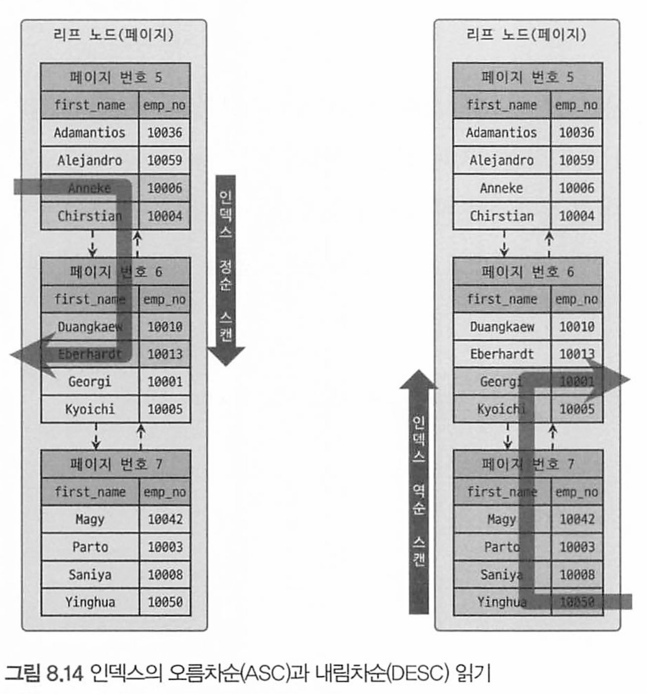
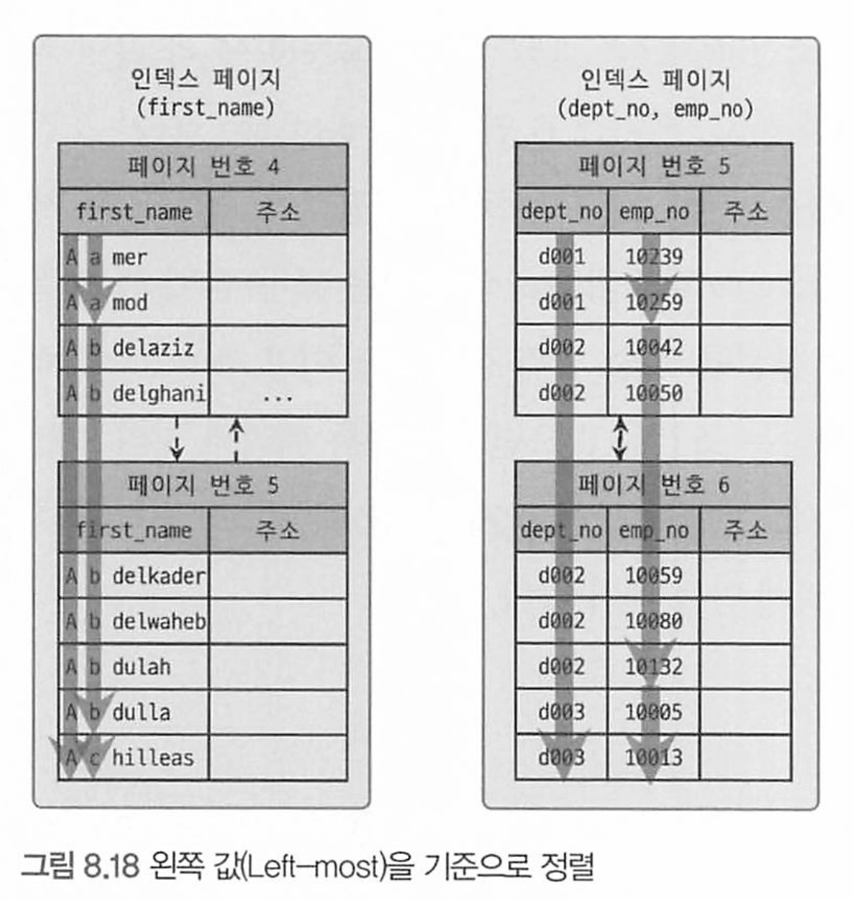

<!-- TOC -->

- [인덱스](#%EC%9D%B8%EB%8D%B1%EC%8A%A4)
    - [B-Tree 인덱스의 정렬 및 스캔 방향](#b-tree-%EC%9D%B8%EB%8D%B1%EC%8A%A4%EC%9D%98-%EC%A0%95%EB%A0%AC-%EB%B0%8F-%EC%8A%A4%EC%BA%94-%EB%B0%A9%ED%96%A5)
        - [인덱스의 정렬](#%EC%9D%B8%EB%8D%B1%EC%8A%A4%EC%9D%98-%EC%A0%95%EB%A0%AC)
        - [인덱스 스캔 방향](#%EC%9D%B8%EB%8D%B1%EC%8A%A4-%EC%8A%A4%EC%BA%94-%EB%B0%A9%ED%96%A5)
        - [내림차순 인덱스](#%EB%82%B4%EB%A6%BC%EC%B0%A8%EC%88%9C-%EC%9D%B8%EB%8D%B1%EC%8A%A4)
    - [B-Tree 인덱스의 가용성과 효율성](#b-tree-%EC%9D%B8%EB%8D%B1%EC%8A%A4%EC%9D%98-%EA%B0%80%EC%9A%A9%EC%84%B1%EA%B3%BC-%ED%9A%A8%EC%9C%A8%EC%84%B1)
        - [비교 조건의 종류와 효율성](#%EB%B9%84%EA%B5%90-%EC%A1%B0%EA%B1%B4%EC%9D%98-%EC%A2%85%EB%A5%98%EC%99%80-%ED%9A%A8%EC%9C%A8%EC%84%B1)
        - [인덱스의 가용성](#%EC%9D%B8%EB%8D%B1%EC%8A%A4%EC%9D%98-%EA%B0%80%EC%9A%A9%EC%84%B1)
        - [가용성과 효율성 판단 - B-Tree에서 사용할 수 없는 조건들](#%EA%B0%80%EC%9A%A9%EC%84%B1%EA%B3%BC-%ED%9A%A8%EC%9C%A8%EC%84%B1-%ED%8C%90%EB%8B%A8---b-tree%EC%97%90%EC%84%9C-%EC%82%AC%EC%9A%A9%ED%95%A0-%EC%88%98-%EC%97%86%EB%8A%94-%EC%A1%B0%EA%B1%B4%EB%93%A4)
- [R-Tree 인덱스](#r-tree-%EC%9D%B8%EB%8D%B1%EC%8A%A4)
    - [구조 및 특성](#%EA%B5%AC%EC%A1%B0-%EB%B0%8F-%ED%8A%B9%EC%84%B1)
    - [R-Tree 인덱스의 용도](#r-tree-%EC%9D%B8%EB%8D%B1%EC%8A%A4%EC%9D%98-%EC%9A%A9%EB%8F%84)
- [전문 검색Full Text search 인덱스](#%EC%A0%84%EB%AC%B8-%EA%B2%80%EC%83%89full-text-search-%EC%9D%B8%EB%8D%B1%EC%8A%A4)
    - [인덱스 알고리즘](#%EC%9D%B8%EB%8D%B1%EC%8A%A4-%EC%95%8C%EA%B3%A0%EB%A6%AC%EC%A6%98)
        - [어근 분석 알고리즘](#%EC%96%B4%EA%B7%BC-%EB%B6%84%EC%84%9D-%EC%95%8C%EA%B3%A0%EB%A6%AC%EC%A6%98)
        - [n-gram 알고리즘](#n-gram-%EC%95%8C%EA%B3%A0%EB%A6%AC%EC%A6%98)
        - [불용어 변경 및 삭제](#%EB%B6%88%EC%9A%A9%EC%96%B4-%EB%B3%80%EA%B2%BD-%EB%B0%8F-%EC%82%AD%EC%A0%9C)
        - [사용자 정의 불용어 사용](#%EC%82%AC%EC%9A%A9%EC%9E%90-%EC%A0%95%EC%9D%98-%EB%B6%88%EC%9A%A9%EC%96%B4-%EC%82%AC%EC%9A%A9)
    - [전문 검색 인덱스의 가용성](#%EC%A0%84%EB%AC%B8-%EA%B2%80%EC%83%89-%EC%9D%B8%EB%8D%B1%EC%8A%A4%EC%9D%98-%EA%B0%80%EC%9A%A9%EC%84%B1)
- [함수 기반 인덱스](#%ED%95%A8%EC%88%98-%EA%B8%B0%EB%B0%98-%EC%9D%B8%EB%8D%B1%EC%8A%A4)
        - [가상 칼럼을 이용한 인덱스](#%EA%B0%80%EC%83%81-%EC%B9%BC%EB%9F%BC%EC%9D%84-%EC%9D%B4%EC%9A%A9%ED%95%9C-%EC%9D%B8%EB%8D%B1%EC%8A%A4)
    - [함수를 이용한 인덱스](#%ED%95%A8%EC%88%98%EB%A5%BC-%EC%9D%B4%EC%9A%A9%ED%95%9C-%EC%9D%B8%EB%8D%B1%EC%8A%A4)
- [멀티 밸류Multi-Value 인덱스](#%EB%A9%80%ED%8B%B0-%EB%B0%B8%EB%A5%98multi-value-%EC%9D%B8%EB%8D%B1%EC%8A%A4)

<!-- /TOC -->

# 8.3.5 인덱스

## 8.3.5 B-Tree 인덱스의 정렬 및 스캔 방향

인덱스 생성시 설정한 정렬 규칙에 따라 인덱스의 키 값은 항상 오름차순이거나 내림차순으로 정렬되어 저장된다. 

오름차순 정렬 인덱스:

```mysql
CREATE INDEX idx_name ON table_name (column_name ASC);
```

내림차순 정렬 인덱스:

```mysql
CREATE INDEX idx_name ON table_name (column_name DESC);
```

* 실제로 해당 정렬 순서를 사용하여 쿼리를 최적화하는 것은 지원하지 않을 수도 있으므로, 내림차순 인덱스는 특별한 경우에만 사용하고, 일반적으로는 오름차순 인덱스를 사용하는 것이 좋다.

### 인덱스의 정렬

MySQL 8.0부터 다음과 같은 형태의 순서를 혼합한 복합 인덱스도 생성할 수 있다.

```mysql
mysql> CREATE INDEX ix_teamname_userscore ON employees (team_name ASC, user_score DESC);
```

### 인덱스 스캔 방향

first_name 칼럼에 대한 인덱스가 포함된 employees 테이블에 대해 다음 쿼리를 실행하는 과정을 한 번 살펴보자

* 인덱스를 처음부터 오름차순으로 끝까지 읽어 first name이 가장 큰(오름차순으로 읽었을 때 가장 마지막 레코드) 값 하나를 가져오는 것일까?

```mysql
mysql> SELECT *
			 FROM employees
			 ORDER BY first_name DESC
			 LIMIT 1;
```

그렇지 않다. 옵티마이저는 바보가 아니다. 인덱스를 역순으로 접근해 첫 번째 레코드만 읽는다



오름차순으로 생성된 인덱스를 정순으로 읽으면 출력되는 결과 레코드는 자동으로 오름차순으로 정렬된 결과가 되고, 

역순으로 읽으면 그 결과는 내림차순으로 정렬된 상태가 되는 것이다.

### 내림차순 인덱스

MySQL 서버에서 다음 두 쿼리는 실제 내림차순인지 오름차순인지와 관계없이 인덱스를 읽는 순서만 변경해서 해결할 수 있다

```mysql
mysql> SELECT * FROM employees ORDER BY first_name ASC LIMIT 10;
mysq1> SELECT * FROM employees ORDER BY first_name DESC LIMIT 10;
```

만약 다음과 같이 2개 이상의 컬럼으로 구성된 복합 인덱스에서 각각의 컬럼이 내림차순과 오름차순이 혼합된 경우에는,

내림차순 인덱스로만 해결될 수 있다.

```mysql
mysql> CREATE INDEX ix_teamname_userscore ON employees (team_name ASC, user_score DESC);
```

그렇다면 first_name 칼럼을 역순으로 정렬하는 요건만 있다면 다음 2개 인덱스 중에서 어떤 것을 선택하는 것이 좋을까? 

아니면 두 인덱스 모두 동일한 성능을 보일까?

```mysql
mysql> CREATE INDEX ix_firstname_as ON employees (first_name ASC ); 
mysql> CREATE INDEX ix_firstname_desc ON employees (first_name DESC);
```


- 오름차순 인덱스(Ascending index): 작은 값의 인덱스 키가 B-Tree의 왼쪽으로 정렬된 인덱스
- 내림차순 인덱스(Descendling index): 큰 값의 인덱스 키가 B-Tree의 왼쪽으로 정렬된 인덱스
- 인덱스 정순 스캔(Forward index scan): 인덱스 키의 크고 작음에 관계없이 인덱스 리프 노드의 왼쪽 페이지부터 오른쪽으로 스캔
- 인덱스 역순 스캔(Backward index scan): 인덱스 키의 크고 작음에 관계없이 인덱스 리프 노드의 오른쪽 페이지부터 왼쪽으로 스캔

`실제 내부적으로는 InnoDB에서 인덱스 역순 스캔이 인덱스 정순 스캔에 비해 느릴 수밖에 없는 다음의 두 가지 이유가 있다.`

- 페이지 잠금이 인덱스 정순 스캔(Forward index scan)에 적합한 구조
    - 페이지 잠금은 인덱스를 순차적으로 읽는 경우에만 효율적이다. 왜냐하면 인덱스 역순 스캔에서는 다음 페이지를 잠그기 전에 현재 페이지의 모든 레코드를 거꾸로 읽어야 하기 때문이다. 이로 인해 추가적인 디스크 I/O 비용이 발생하며, 이는 인덱스 역순 스캔을 더 느리게 만든다
      - 페이지 내의 레코드를 거꾸로 읽어야 하므로, 디스크의 읽기 패턴이 비연속적이여서 디스크 헤드의 불필요한 움직임이 발생하며, 이는 추가적인 디스크 I/O 비용을 발생시키는것이다.
- 페이지 내에서 인덱스 레코드가 단방향으로만 연결된 구조
    - InnoDB의 페이지 내부에서는 레코드들이 단방향으로만 링크를 가지고 있다. 즉, 각 레코드는 다음 또는 자식 레코드를 가리키는 링크를 가지고 있지만, 이전 레코드를 가리키는 링크는 없기 때문이다. 이런 구조는 정순 스캔에 유리하나, 역순 스캔에는 비효율적이다. 왜냐하면 역순 스캔을 하려면 매번 페이지의 마지막 레코드부터 거꾸로 읽어야 하기 때문이다.

https://tech.kakao.com/2018/06/19/mysql-ascending-index-vs-descending-index/#1-%ED%8E%98%EC%9D%B4%EC%A7%80-%EC%9E%A0%EA%B8%88%EC%9D%B4-forward-index-scan%EC%97%90-%EC%A0%81%ED%95%A9%ED%95%9C-%EA%B5%AC%EC%A1%B0
> 각 데이터 페이지(InnoDB에서 데이터 파일은 프라이머리 키 인덱스 자체라는 것에 주의하자)나 인
>
> 덱스 페이지의 엔트리(데이터 레코드 또는 인덱스 키)는 키 값과 데이터를 가지는데, 
>
> 인덱스(프라이머리 키 인덱스와 세컨더리 인덱스 모두)의 루트 노드 또는 브랜치 노드라면 자식 노드의 주소를 가진다. 
>
> \- 리프 노드가 아니면 포인터를 가진다는 말이다. 데이터는 리프노드에 있다.
>
> 프라이머리 키에서 리프 노드의 "데이터"는 실제 레코드의 칼럼 값들이며, 세컨더리 인덱스 페이지에서는 프라이머리 키 값을 가진다.


일반적으로 ORDER BY ... DESC 하는 쿼리가 소량으로 생성된다면 내림차순 인덱스를 고려할 필요는 없지만

`아주 자주 사용된다면 내림차순 인덱스를 고려하자!`

* 성능차이가 꽤 많이난다

내림차순 정렬 인덱스:

```mysql
CREATE INDEX idx_name ON table_name (column_name DESC);
```

* 실제로 해당 정렬 순서를 사용하여 쿼리를 최적화하는 것은 지원하지 않을 수도 있으므로, 내림차순 인덱스는 특별한 경우에만 사용하고, 일반적으로는 오름차순 인덱스를 사용하는 것이 좋다.

## B-Tree 인덱스의 가용성과 효율성

### 비교 조건의 종류와 효율성

다중 컬럼 인덱스(복합 인덱스)에서 각 컬럼의 순서와 사용된 조건이 동등 (=) 크다(>) 작다 (<) 같은 범위 조건인지에 따라 칼럼의 활용 형태랑 효율이 달라진다

다음 예제를 한번 살펴보자.

```mysql
mysql> SELECT * FROM dept_emp
			 WHERE dept_no='d002' AND emp_no >= 10114;
```

이 쿼리를 위해 dept_emp 테이블에 각각칼럼의 순서만 다른 두 가지 케이스로 인덱스를 생성했다고 가정

* 케이스 A: INDEX (dept_no, emp_no)

* 케이스 B: INDEX (emp_no, dept _no)


케이스 A 인덱스는 효율적이다.

* dept_no는 정렬되어있으므로 dept_no = d002인 애들만 찾고 dept_no가 d002가 아닐때까지 인덱스를 읽기만 하면되기 때문 

케이스 B는 비효율적이다

* emp_no>= 10144 and dept_no = d002인 레코드를 찾고 모든 레코드에 대해 dept_no = d002인지 비교해야 하기 때문

즉 필터링을 더 많이 하게되며, 비교 작업의 범위를 좁혀야 하는데 

케이스 A의 2번째 칼럼인 emp_no는 범위를 좁혔고, 케이스 B의 2번째 칼럼인 dept_no 비교 작업의 범위를 좁히지 못하고 쿼리 조건에 맞는지 검사하는 용도로만 사용됐기 때문이다 

1. '작업 범위 결정 조건': 이 조건은 검색할 데이터의 범위를 좁혀주며, 작업 범위를 결정하는 조건이 많아질수록 해당 범위는 좁아져서 필요한 데이터를 더 빠르게 찾을 수 있게 된다. 케이스 A에서 'dept_no'와 'emp_no'가 이에 해당한다.
2. '필터링 조건' 또는 '체크 조건': 이 조건은 범위를 좁히는 것이 아니라, 범위 안에서 어떤 데이터가 조건에 맞는지 확인하는 역할을 한다. 이것은 결과의 정확성을 보장하지만, 성능 향상에는 크게 기여하지 않는다. 케이스 B에서 'dept_no'가 이에 해당한다.

`'작업 범위 결정 조건'이 앞에 오고, 그 뒤에 '필터링 조건'이 위치하는 것이 일반적으로 더 효율적이다.`

 그러나 항상 이런 원칙에 따르는 것은 아니며, 실제 쿼리 패턴과 데이터의 분포를 고려해야 한다.

### 인덱스의 가용성

B-Tree 인덱스의 특징은 왼쪽 값에 기준해서(Left-most) 오른쪽 값이 정렬돼 있다

여기서 왼쪽이란 하나의 칼럼 내에서뿐만 아니라 다중 칼럼 인덱스의 칼럼에 대해서도 함께 적용된다.

- 케이스 A: INDEX (first_name)
- 케이스 B: INDEX (dept_no, emp_no)



```mysql
mysql> SELECT * FROM employees WHERE first name LIKE '%mer'
```

이 쿼리는 인덱스 레인지 스캔 방식으로 인덱스를 사용할 수 없다.

first_name 칼럼에 저장 된 값의 왼쪽부터 한 글자씩 비교해 가면서 일치하는 레코드를 찾아야 하는데, 

조건절에 주어진 상숫값 (''%mer')에는 왼쪽 부분이 고정되지 않았기 때문이다.

> 이 쿼리는 "mer"로 끝나는 모든 문자열을 찾는것인데 
> 인덱스는 기본적으로 문자열의 앞부분으로 정렬되므로, 끝나는 부분에 대한 검색은 전체 인덱스를 훑어야 하는 full scan을 발생시킨다
>
> 반면 LIKE 'mer%' 는 다르다.
>
> 인덱스를 순차적으로 읽어 'mer'로 시작하는 첫 번째 항목을 찾고, 'mer'로 시작하지 않는 항목이 나올 때까지 계속 읽는 것이 가능하기 때문이다.

### 가용성과 효율성 판단 - B-Tree에서 사용할 수 없는 조건들

B-Tree 인덱스의 특성상 다음 조건절에서는 작업 범위 결정 조건으로 사용할 수 없고, 경우에 따라서는 체크 조건으로 인덱스를 사용할 수는 있다.

1. **NOT-EQUAL 비교**
   - `WHERE column <> 'N'`
   - `WHERE column NOT IN (10, 11, 12)`
   - `WHERE column IS NOT NULL`
2. **문자열 패턴 비교 (앞부분이 아닌 뒷부분 일치)**
   - `WHERE column LIKE '%승환'`
3. **인덱스 칼럼 변형 후 비교**
   - `WHERE SUBSTRING(column, 1, 1) ='X'`
   - `WHERE DAYOFMONTH(column) = 1`
4. **NOT-DETERMINISTIC 속성의 스토어드 함수가 비교 조건에 사용**
   - `WHERE column = deterministic_function()`
5. **데이터 타입이 서로 다른 비교 (인덱스 칼럼의 타입을 변환해야 비교 가능)**
   - `WHERE char_column = 10`
6. **문자열 데이터 타입의 콜레이션 (정렬 및 비교 규칙)이 다른 경우**
   - `WHERE utf8_bin_char_column = euckr_bin_char_column`

다른 일반적인 DBMS에서는 NULL 값이 인덱스에 저장되지 않지만 MySQL에서는 NULL 값도 인덱스에 저장된다. 다음과 같은 WHERE 조건도 `작업 범위 결정 조건`으로 인덱스를 사용한다.

```mysql
mysql> WHERE column IS NULL ..
```

다중 컬럼 인덱스의 사용할 수 있는 조건과 없는 조건을 보자

ex) 다음 인덱스를 바탕으로 정리

```mysql
INDEX ix_test ( column_1, column_2, column_3, .., column_n)
```

1. **작업 범위 결정 조건으로 인덱스를 사용하지 못하는 경우**
   - column_1에 대한 조건이 없음
   - column_1의 비교 조건이 인덱스 사용 불가 조건 중 하나에 해당함
2. **작업 범위 결정 조건으로 인덱스를 사용하는 경우**
   - column_1 ~ column_(i-1)까지 동등 비교 형태("=" 또는 "IN")로 비교
   - column_i에 대해 다음 연산자 중 하나로 비교:
     - 동등 비교("=" 또는 "IN")
     - 크다 작다 형태(">" 또는 "<")
     - LIKE로 좌측 일치 패턴 (`LIKE '승환%'`)

또 다른 예제를 보자

```mysql
-- 인덱스를 사용할 수 없는 쿼리 예시 (colum_1 <> 2 사용으로 인해)
-- 인덱스 사용 불가 X
mysql> WHERE column_1 <> 2;

-- 범위 결정 조건으로 인덱스를 사용하는 쿼리 예시 (column_1과 column_2까지 범위 결정 조건으로 사용)
-- 인덱스 사용 가능 O
mysql> WHERE column_1 = 1 AND column_2 > 10;

-- 범위 결정 조건으로 인덱스를 사용하는 쿼리 예시 (column_1, column_2, colum_3까지 범위 결정 조건으로 사용)
-- 인덱스 사용 가능 O
mysql> WHERE column_1 IN (1,2) AND column_2 = 2 AND column_3 <= 10;

-- 범위 결정 조건과 체크 조건으로 인덱스를 사용하는 쿼리 예시 
-- (colum_1, column_2, colum_3까지 범위 결정 조건으로, colum_A는 체크 조건으로 사용)
-- 인덱스 사용 가능 O
mysql> WHERE column_1 = 1 AND column_2 = 2 AND column_3 IN (10,20,30) AND column_4 < 100;

-- 범위 결정 조건으로 인덱스를 사용하는 쿼리 예시 
-- (column_1, column_2, column_3, column_4까지 범위 결정 조건으로 사용)
-- 인덱스 사용 가능 O
mysql> WHERE column_1 = 1 AND column_2 = 2 AND column_3 IN (10,20,30) AND column_4 < 100;

-- 좌측 패턴 일치 LIKE 비교는 크다 또는 작다 비교와 동급으로 생각하면 됨
-- 범위 결정 조건으로 인덱스를 사용하는 쿼리 예시 
-- (column_1, column_2, column_3, column_4까지 범위 결정 조건으로 사용)
-- 인덱스 사용 가능 O
mysql> WHERE column_1 = 1 AND column_2 IN (2,4) AND column_3 = 30 AND column_4 LIKE '8%';

-- 범위 결정 조건으로 인덱스를 사용하는 쿼리 예시 
-- (column_1, column_2, column_3, column_4, column_5까지 모두 범위 결정 조건으로 사용)
-- 인덱스 사용 가능 O
mysql> WHERE column_1 = 1 AND column_2 = 2 AND column_3 = 30 
       AND column_4 = '김승환' AND column_5 = '서울';

```


# 8.4 R-Tree 인덱스

R-Tree 인덱스는 공간적 데이터를 처리하기 위한 트리 기반의 데이터 구조

*  "R"은 렉텡글(rectangle) 또는 범위(range)를 나타낸다

B-Tree를 구성하는 칼럼의 값이 1차원 스칼라 값이면, R-Tree 인덱스는 2차원의 공간 개념 값이다.

MySQL의 공간(Spatial) 타입에는 다음과 같이 세가지 기능이 들어있다.

- 공간 데이터를 저장할 수 있는 데이터 타입
- 공간 데이터의 검색을 위한 공간 인덱스(R-Tree 알고리즘)
- 공간 데이터의 연산 함수(거리 또는 포함 관계의 처리)

## 8.4.1 구조 및 특성

기하학적 도형(Geometry) 정보를 관리할 수 있는 데이터 타입을 제공한다


* GEOMETRY 타입은 point, line, polygon의 SUPER 타입으로 세 객체 모두 저장할 수 있다.

MBR이란 Minimum Bounding Rectangle의 약자로 해당 도형을 감싸는 최소 크기의 사각형을 의미한다.

이 사각형들의 포함 관계를 B-Tree 형태로 구현한 인덱스가 R-Tree 인덱스다


R-Tree 인덱스의 구조를 이해하려면 도형들의 MBR을 먼저 알아야 한다.


* 최상위 레벨 : R1, R2
* 차상위 레벨 : R3, R4, R5, R6
* 최하위 레벨 : R7 ~ R14

> MBR은 해당 데이터 요소를 완전히 포함하는 가장 작은 사각형을 의미

최하위 레벨의 MBR(각 도형을 제일 안쪽에서 둘러싼 점선 상자)은 각 도형 데이터의 MBR을 의미한다.

차상위 그룹 MBR은 R-Tree의 브랜치 노드가 되며, 각 도형의 객체는 리프 노드에 저장된다


이렇게 각각의 노드는 해당 노드의 하위 요소를 포함하는 최소한의 공간을 표현하는 MBR을 가지며, 이는 R-Tree의 기본 구조

## R-Tree 인덱스의 용도

일반적으로는 WGS84(GPS) 기준의 위도, 경도 좌표 저장에 주로 사용된다. 

* WGS84 (World Geodetic System 1984)는 지구의 크기, 모양, 물리적, 중력장 등에 대한 정보를 포함하는 좌표 시스템

R-Tree는 각 도형의 MBR의 포함관게를 이용해 만들어진 인덱스다

따라서 ST_Contains() 또는 ST_Within() 등과 같은 포함 관계를 비교하는 함수로 검색을 수행하는 경우에만 인덱스를 이용할 수 있다.

* **현재 출시되는 버전의 MySQL 에서는 거리를 비교하는 ST_Distance()와 ST_Distance_Sphere() 함수는 공간 인덱스를 효율적으로 사용하지 못하기 때문에   ST_Contains() 또는 ST_Within()를 사용하여 거리 기반의 검색을 해야 한다.**

`단순 직교 좌표계의 경우에는 R-Tree 인덱스의 혜택을 받기 어려우므로, 인덱스 적용을 위해서는 반드시 입력 데이터에 적합한 SRID를 적용해야만 한다`


가운데 위치한 P가 기준점이다.

기준점으로부터 반경 5Km 이내의 위치를 검색하려면 사각 점선의 상자에 포함되는 점들을 검색하면 된다.

* ST_Contains() 또는 ST_Within()함수 이용

* 여기서 ST_Contains()나 ST_within() 연산은 사각형 박스와 같은 다각형(Polygon)으로만 연 산할 수 있으므로 반경 5km를 그리는 원을 포함하는 최소 사각형(MBR)으로 포함 관계 비교를 수행한 것이다

점 P6(그림의 왼쪽 상단)은 기준점 P로부터 반경 5KM 이상 포함되지만 최소 사각형 내에는 포함된다.

* P6을 결과에 포함해도 무방하다면 다음 쿼 리와 같이 ST_Contains()나 ST_within() 비교만 수행하는 것이 좋다.

```mysql
-- // ST_Contains() 또는 ST within()을 이용해 "사각 상자"에 포함된 좌표 Px만 검색

mysql> SELECT * FROM tb_location
			 WHERE ST_Contains(사각 상자, px);

mysql> SELECT * FROM tb_location
			 WHERE ST_within(px, 사각 상자);
```

ST_Contains() 함수와 ST_within() 함수는 거의 동일한 비교를 수행하지만 `두 함수의 파라미터는 반대로 사용해야 한다`

* ST_Contains()함수는 첫 파라미터로 포함 경계를 가진 도형을 명시, 두번째 파라미터로 포함되는 도형또는 좌표를 명시
  * 즉, "A는 B를 포함하고 있는가?" 라는 관점
* ST_within() 함수는 첫 번째 파라 미터로 포함되는 도형(또는 점 좌표)을 명시하고 두 번째 파라미터로 포함 경계를 가진 도형을 명시
  * 즉, "B는 A 내부에 있는가?"라는 관점

`만약 위에 왼쪽 상단의 P6를 제거하고 싶다면?`

* ST_Distance_Sphere() 함수를 이용해 필터링 해야한다.

```mysql
SELECT * FROM tb_location
WHERE ST_Contains(사각상자, PX) - 1/ 공간 좌표 Px가 사각 상자에 포함되는지 비교
AND ST_Distance_Sphere(p, px) <= 5 * 1000 /* 5km */; 단위 M
```

* ST_Distance_Sphere()는 각 좌표는 (경도, 위도) 형태로 표현되며, WGS84 좌표계를 기반으로 한다.

```mysql
SELECT ST_Distance_Sphere(point1, point2);
```

`point1`과 `point2`는 각각 첫 번째 점과 두 번째 점의 좌표를 나타냅니다. 이 값들은 `POINT` 데이터 타입을 사용하여 생성할 수  있다.

```mysql
SELECT ST_Distance_Sphere(ST_Point(37.7749, -122.4194), ST_Point(34.0522, -118.2437));
```

이 쿼리는 

* 첫 번째 점이 샌프란시스코 (위도 37.7749, 경도 -122.4194)이고 
* 두 번째 점이 로스앤젤레스 (위도 34.0522, 경도 -118.2437)일 때, 

두 도시 사이의 대략적인 거리를 미터 단위로 반환한다.

# 8.5 전문 검색(Full Text search) 인덱스

MySQL의 B-Tree 인덱스는 실제 칼럼의 값이 1MB이더라도 `1MB 전체의 값을 인덱스 키로 사용하는 것이 아니라`

`1,000바이트(MyISAM) 또는 3072바이트 (InnoDB)까지만 잘라서 인덱스 키로 사용한다`.

 또한 B-Tree 인덱스의 특성에서도 알아봤듯이 전체 일치 또는 좌측 일부 일치와 같은 검색만 가능하다.

**전문(FullText) 검색** : 문서의 내용 전체를 인덱스화해서 특정 키워드가 포함된 문서를 검색. 텍스트 기반의 데이터에서 특정 단어 또는 표현을 찾기 위한 검색 방식이다.

* Full Text 검색에는 일반적인 용도의 B-Tree 인덱스를 사용할 수 없다.

## 인덱스 알고리즘

전문 검색에서는 키워드로 인덱스를 구축한다.

키워드의 분석 및 인덱스는 키워드를 인덱싱 하는 기법에 따라 크게`단어의 어근 분석`과 `n-gram` 분석 알고리즘으로 구분할 수 있다.

### 어근 분석 알고리즘

MySQL 서버의 전문 검색 인덱스는 다음과 같은 두 가지 중요한 과정을 거쳐서 색인 작업이 수행된다.

- 불용어(Stop Word) 처리
- 어근 분석(Stemming)

**불용어 처리** : 검색에서 가치가 없는 단어를 필터링해서 제거하는 작업. 현재 MySQL은 불용어를 소스코드에 미리 정의돼 있지만 이를 무시하고 사용자가 별도로 불용어를 정의할 수 있는 기능을 제공한다. 

**어근 분석** : 검색어로 선정된 단어의 원형을 찾는 작업. MySQL에서는 오픈소스 분석 라이브러리인 MeCab(https://taku910.github.io/mecab/) 을 지원한다. 일본어 지만 그나마 한국어가 일본어와 많이 비슷하기 때문에 MeCab을 이용해 한글 분석이 가능하다. 

### n-gram 알고리즘

위에서 설명한 어근 분석 알고리즘은 범용적으로 적용하기 쉽지 않다.

때문에 이런 단점을 보완하기 위해 n-gram 알고리즘이 도입되었다. 

형태소 분석이 문장을 이해하는 알고리즘이라면, n-gram은 단순히 키워드를 검색해내기 위한 인덱싱 알고리즘이라고 할 수 있다.

**n-gram** :  텍스트를 연속된 N개의 문자 또는 단어로 나누는 방법. 무조건 몇 글자씩 잘라서 인덱싱 하는 방법이다.

형태소 분석보다 알고리즘이 단순하고 국가별 이해와 준비 작업이 필요 없는 반면, 만들어진 인덱스의 크기가 상당히 크다.

n-gram에서 n은 인덱싱할 키워드의 최소 글자 수이다.

일반적으로 2글자 단위로 키워드를 쪼개서 인덱싱하는 2-gram(Bi-gram)방식이 많이 사용된다.

**MySQL 서버의 n-gram 알고리즘을 이해하기 위해 2-gram 알고리즘으로 다음 문장의 토큰을 분리 하는 방법을 한번 살펴보자.**

```
To be or not to be. That is the question
```

* 각 단어는 띄어쓰기, 마침표를 기준으로 10개의 단어로 구분되고 2글짜식 중첩해서 토큰으로 분리된다.
  * 주의해야 할 것은 각 글자가 중첩되서 2글자씩 토큰으로 구분된다.
  * 10글자 단어라면 그 단어는 2-gram 알고리즘에서는 (10-1)개의 토큰으로 구분된다


MySQL은 생성된 토큰들에 대해 불용어를 걸러내는 작업을 수행하는데, 이때 불용어와 동일하거나 불용어를 포함하는 경우 걸러서 버린다. 기본적으로 MySOL에 내장된 불용어는 `information_schema.innodo_ft _default_stopword 테이블`을 통해 확인할 수 있다.

```mysql
 SELECT * FROM information_schema. INNODB_FT_DEFAULT_STOPWORD;

|-------| 
| value |
|-------|
| a     |
| about |
| an    |
...
|-------|
36 rows in set (0.00 sec)
```

* https://hoing.io/archives/5456 참고하면 좋은자료 많다

* https://dev.mysql.com/doc/refman/8.0/en/information-schema-innodb-ft-default-stopword-table.html 여기 잘 나와있다.

결과적으로, MySQL 에서는 불용어가 일치하거나, 포함되지 않는 단어만 인덱스에 등록하고 나머지는 버린다.


물론 전문 검색을 더 빠르게 하기 위해 2단계 인덱싱(프런트엔드와 백엔드 인덱스)과 같은 방법도있지 만 MySQL 구분된 토큰을 단순한 B-Tree 인덱스에 저장한다. 

* 2단계 인덱싱 : 이 방식은 전체 검색 공간을 두 단계로 나누어 검색 작업을 수행하는 것
* 프런트엔드 인덱스를 통해 검색 범위를 줄이고, 그 결과로 나온 제한된 데이터 세트에 대해 백엔드 인덱스를 사용해 세밀한 검색을 수행


### 불용어 변경 및 삭제

불용어를 처리하고 삭제하는 과정에서 사용자를 혼란스럽게 할 수 있으므로, 

불용어 처리를 무시하거나 사용자가 직접 불용어를 등록하는 방법을 권장한다.

**전문 검색 인덱스(full text index)의 불용어 처리 무시**

1.  스토리지 엔진 관계 없이 MySQL의 모든 전문 검색 인덱스에 대해 불용어 제거방법

MySQL 설정 파일(my.cnf)의 ft_stopword_file 시스템 변수에 빈 문자열 설정

```
ft_stopword_file=''
```

* 설정 후 MySQL 서버를 재시작 해야 한다.

ft_stopword_file 변수는 사용자가 직접 정의한 불용어 목록을 정리한 파일의 경로를 설정하면 해당 파일에서 불용어 목록을 가져와 사용하기도 한다.

* 용어를 포함하는 텍스트 파일을 생성합니다. 각 단어는 별도의 줄에 위치하게 하면 된다

* ```
  // 위치 : /etc/mysql/stopwords.txt
  -- 다음은 내용이다
  
  the
  is
  are
  ```

* 다음 my.cnf에 다음 내용 기록

* ```
  [mysqld]
  ft_stopword_file=/etc/mysql/stopwords.txt // 적용 후에 재시작 해야한다.
  ```


2. InnoDB 스토리지 엔진 사용 테이블에 대해서만 불용어 처리 무시

`innodb_ft_enable_stopword` 시스템 변수를 OFF로 설정하면 된다. 동적 시스템 변수이므로 실행중인 상태에서도 변경할 수 있다.

```mysql
mysql> SET GLOBAL innodb_ft_enable_stopword=OFF;
```

### 사용자 정의 불용어 사용

1.  불용어 목록을 파일로 저장하고, MySQL 설정 파일에서 파일의 경로를 다음과 같이 ft_stopword_file 설정에 등록하면 된다.

```
ft_stopword_file='/data/my_custom_stopword.txt'
```

2. InnoDB 스토리지 엔진을 사용하는 테이블의 전문 검색 엔진에서만 사용할 수 있는 불용어의 목록을 테이블로 저장하는 방식

 다음과 같이 불용어 테이블을 생성하고, `innodb_ft server_stopword_table 시스템 변수에 불용어 테이블을 설정하면 된다`

* 불용어 목록을 변경한 이후 인덱스가 생성되어야만 변경된 불용어가 적용된다

```mysql
CREATE TABLE my_stopword(value VARCHAR(30)) ENGINE = INNODB;
INSERT INTO my_stopword(value) VALUES ('MySQL');
SET GLOBAL innodb_ft_server_stopword_table='mydb/my_stopword';

ALTER TABLE tb_bi_gram
	ADD FULLTEXT INDEX fx_title_body (title, body) WITH PARSER ngram;
```

innodb_ft_user_stopword_table 시스템 변수를 이용하는 방법도 있는데, innodb_ft_server_stopword_ table 시스템 변수와 사용법은 동일하다. 단, 여러 전문 검색 인덱스가 서로 다른 불용어를 사용해야 하는 경우라면 innodb ft user_stopword_table 시스템 변수를 이용하면 된다.


## 전문 검색 인덱스의 가용성

전문 검색 인덱스를 사용하려면 반드시 다음 두 가지 조건을 갖춰야 한다.

- 쿼리 문장이 전문 검색을 위한 문법(`MATCH ... AGAINST ...)을 사용`
- 테이블이 전문 검색 대상 칼럼에 대해서 전문 인덱스 보유

ex) doc_body 컬럼에 full text 인덱스 생성

```mysql
CREATE TABLE tb_test (
	doc_id INT, 
  doc_body TEXT, 
  PRIMARY KEY (doc_id),
	FULLTEXT KEY fx docbody (doc body) WITH PARSER ngram
) ENGINE=InnoDB;
```

다음과 같이 like 쿼리로도 원하는 검색 결과를 얻을 수 있지만, 풀 텍스트 인덱스를 사용한 것이 아닌 풀 테이블 스캔을 이용한 것이므로 주의하자.

```mysql
SELECT * FROM tb_test WHERE doc_body LIKE '%애플%';
```

전문 검색 인덱스를 사용하려면 MATCH (...) AGAINST (...) 구문으로 쿼리를 작성해야 하며, 

전문 검색 인덱스를 구성하는 칼럼들은 MATCH 절의 괄호 안에 모두 명시돼야 한다

```mysql
SELECT * FROM tb_test
WHERE MATCH(doc body) AGAINST('애플' IN BOOLEAN MODE);
```

`BOOLEAN MODE`에서 사용할 수 있는 몇 가지 특수한 구문은 다음과 다

- `+`: 이 기호가 단어 앞에 있으면, 그 단어는 결과에 반드시 포함되어야 한다.
- `-`: 이 기호가 단어 앞에 있으면, 그 단어는 결과에 포함되어서는 안 된다.
- `>` `<`: 이 기호는 단어의 관련성을 높이거나 낮춘다. 
  - 즉, `>`가 있으면 그 단어는 결과의 관련성을 높이고, `<`가 있으면 관련성을 낮춘다
- `*`: 이 기호는 와일드카드로서 사용되며, 단어의 일부만 알고 있는 경우에 유용하다. 
  - 예를 들어, `appl*`는 "apple", "application" 등의 단어를 검색한다.
- `"`: 따옴표를 사용하면 여러 단어로 구성된 구문을 검색할 수 있다. 
  - 예를 들어, `"apple computer"`는 그 두 단어가 함께 나타나는 결과만을 검색한다

MySQL의 FULLTEXT 검색에서는 크게 두 가지 검색 모드를 사용할 수 있다

*  `NATURAL LANGUAGE MODE`와 `BOOLEAN MODE`

1. `NATURAL LANGUAGE MODE`: 이 모드는 기본적으로 설정되어 있으며, 자연어 처리 기술을 활용해 검색 쿼리를 해석한다. 이 모드에서는 검색어의 출현 빈도, 문서의 길이 등을 고려하여 문서의 관련성을 계산한다.
2. `BOOLEAN MODE`: 이 모드를 사용하면 특수한 구문을 활용해 검색 쿼리를 더욱 세밀하게 제어할 수 있다. 예를 들어, `+` 또는 `-` 기호를 사용하여 특정 단어가 결과에 포함되거나 제외되도록 지시할 수 있다.

추가적으로, `QUERY EXPANSION MODE`라는 확장 검색 모드도 존재하는데, 먼저 검색 쿼리를 사용하여 검색을 수행하고, 이를 바탕으로 추가적인 관련 단어를 찾아내어 검색 쿼리를 확장한다. 이 모드는 사용자가 정확한 검색어를 모르는 경우에 유용할 수 있다. 이 모드를 사용하려면 `WITH QUERY EXPANSION`을 검색 쿼리에 추가한다.


이들 각각의 모드는 `MATCH(column) AGAINST('query' IN MODE)` 구문에서 `MODE` 부분을 대체하여 사용된다. 
예를 들어, `NATURAL LANGUAGE MODE`를 사용하려면 다음과 같이 쿼리를 작성한다:

```mysql
sqlCopy code
SELECT * FROM table
WHERE MATCH(column) AGAINST('query' IN NATURAL LANGUAGE MODE);
```

동일하게, `BOOLEAN MODE`와 `QUERY EXPANSION MODE`를 사용하는 경우도 다음과 같이 쿼리를 작성한다:

```mysql
SELECT * FROM table
WHERE MATCH(column) AGAINST('query' IN BOOLEAN MODE);

SELECT * FROM table
WHERE MATCH(column) AGAINST('query' WITH QUERY EXPANSION);
```

# 8.6 함수 기반 인덱스

일반적으로 컬럼에 함수를 이용해서 변형을 가하면 인덱스가 동작하지 않는다.

때로는 칼럼의 값을 변형해서 만들어진 값에 대해 인덱스를 구축해야 할 때도 있는데, 이러한 경우 함수 기반의 인덱스를 활용하면 된다

 MySOL. 서버에서 함수 기반 인덱스를 구현하는 방법은 다음과 같이 두 가지로 구분할 수 있다.

- 가상 칼럼을 이용한 인덱스
- 함수를 이용한 인덱스

MySQL 서버의 함수 기반 인덱스는 인덱싱할 값을 계산하는 과정의 차이만 있을 뿐, 실제 인덱스의 내 부적인 구조 및 유지관리 방법은 B-Iree 인덱스와 동일하다.

### 가상 칼럼을 이용한 인덱스

ex) 사용자 정보 저장 테이블

```mysql
CREATE TABLE user ( 
  user_id BIGINT,
	first_name VARCHAR(10), 
  last_name VARCHAR(10), 
  PRIMARY KEY (user_id)
);
```

만약 first_name + last_name을 검색해야 하는 요건이 생긴다면?

다음과 같이 가상 칼럼을 추가하고 그 가상 칼럼에 인덱스를 생성할 수 있다.

```mysql
ALTER TABLE user
	ADD full_name VARCHAR(30) AS (CONCAT(first_name, ' '‚last_name)) VIRTUAL, 
	ADD INDEX ix_fullname (full_name);
```

새로 만들어진 ix_fulIname 인덱스를 이용해 실행 계획이 만들어지는 것을 확인할 수 있다. 

```mysql
EXPLAIN SELECT * FROM user WHERE full_name='Matt Lee';

+----+-------------+-------+--------+--------------+-----------+---------+------+------+----------+
| id | select_type | table | type   | possible_keys| key       | key_len | ref  | rows | Extra    |
+----+-------------+-------+--------+--------------+-----------+---------+------+------+----------+
|  1 | SIMPLE      | user  | ref    | ix_fullname  | ix_fullname|  1023  | const| 1    | NULL     |
+----+-------------+-------+--------+--------------+-----------+---------+------+------+----------+

```

가상 칼럼은 테이블에 새로운 칼럼을 추가하는 것과 같은 효과를 내기 때문에 실제 테 이블의 구조가 변경된다는 단점이 있다.

## 함수를 이용한 인덱스

MySQL 8.0 버전부터는 다음과 같이 테이블의 구조를 변경하지 않고 , 함수를 직접 사용하는 인덱스를 생성할 수 있게 됐다.

```mysql
CREATE TABLE user (
	user_id BIGINT.
	first_name VARCHAR(10), 
  last_name VARCHAR(10), 
  PRIMARY KEY (user_id),
	INDEX ix_fullname ((CONCAT (first_name,' '‚last_name))
)
```

함수 기반 인덱스를 제대로 활용하려면 반드시 조건절에 함수 기반 인덱스에 명시된 표현식이 그대로 사용돼야 한다. 

함수 생성 시 명시된 표현식과 쿼리의 WHERE 조건절에 사용된 표현식이 다르다면 (설령  검색 결과는 같다고 하더라도) 

MySOL 옵티마이저는 다른 표현식으로 간주해서 함수 기반 인덱스를 사용하지 못한다.

만약 다음과 같이 공백을 포함한 검색을 실행했을 떄,

```mysql
EXPLAIN SELECT * FROM user WHERE CONCAT(first_name,' '‚last_name)='Matt Lee';
```

* `Matt Lee`

공백 문자 리터럴 때문일 수 있으므로, 다음 3개의 시스템 변수의 값을 동일 콜레이션으로 일치시킨 후 수행하면 된다.

- collation_connection
- collation_database
- collation_server

> 가상 칼럼과 함수 인덱스는 내부적으로 동일한 구현 방법을 사용하므로 둘의 성능 차이는 발생하지 않는다. 

# 8.7 멀티 밸류(Multi-Value) 인덱스

멀티 밸류(Multi-Value) 인덱스는 하나의 데이터 레코드가 여러 개의 키 값을 가질 수 있는 형태의 인덱스다

* 최근 RDBMS들이 JSON 데이터 타입을 지원하기 시작 하면서 JSON의 배열 타입의 필드에 저장된 원소(Element)들에 대한 인덱스 요건이 발생한 것이다.

ex) 신용 정보 점수를 배열로 JSON 타입 컬럼에 저장하는 테이블

```mysql
CREATE TABLE user (
	user_id BIGINT AUTO_INCREMENT PRIMARY KEY, 
  first_name VARCHAR(10), 
  last_name VARCHAR(10),
  credit_info JSON,
	INDEX m_creditscores ( (CAST(credit_info->'$.credit_scores' AS UNSIGNED ARRAY)) 
);
  
mysql> INSERT INTO user VALUES (1, 'Matt', 'Lee', '"credit_scores": [360, 353, 351]}');
```

멀티 밸류 인덱스를 활용하기 위해서는 일반적인 조건 방식을 사용하면 안 되고,
반드시 다음 함수들을 이용해서 검색해야 옵티마이저가 인덱스를 활용한 실행 계획을 수립한다.

 MEMBER OF()

- JSON_CONTAINS()
- JSON_OVERLAPS()

이제 신용 점수를 검색하는 쿼리를 한번 살펴보자.

```mysql
EXPLAIN SELECT * FROM user WHERE 360 MEMBER OF(credit_info->'$.credit_scores');

+----+-------------+-------+--------+-----------------+-----------------+---------+------+------+-------------+
| id | select_type | table | type   | possible_keys   | key             | key_len | ref  | rows | Extra       |
+----+-------------+-------+--------+-----------------+-----------------+---------+------+------+-------------+
|  1 | SIMPLE      | user  | ref    | mx_creditscore  | mx_creditscore  |  9      | const| 1    | Using where |
+----+-------------+-------+--------+-----------------+-----------------+---------+------+------+-------------+

```

이 예제에서는 MEMBER OF() 연산자를 사용했지만 나머지 두 연산자도 모두 멀티 밸류 인덱스를 활용해 실행 계획이 만들어진다.

**참고**

MySQL 서버의 Workog 에는 

* DECIMAL, 
* INTEGER, 
* DATETIME,
* VARCHAR/ CHAR 타입에 대해 멀티 밸류 인덱스를 지원한다고 명시돼 있지만 

MySQL 8.0.21 버전에서는 CHAR/VARCHAR 타입에 대해서는 지원하지 않는다. 

하지만 곧 CHAR/VARCHAR 타입의 배열 형태 CAST와 멀티 밸류 인덱스가 지원될 것으로 예상한다.