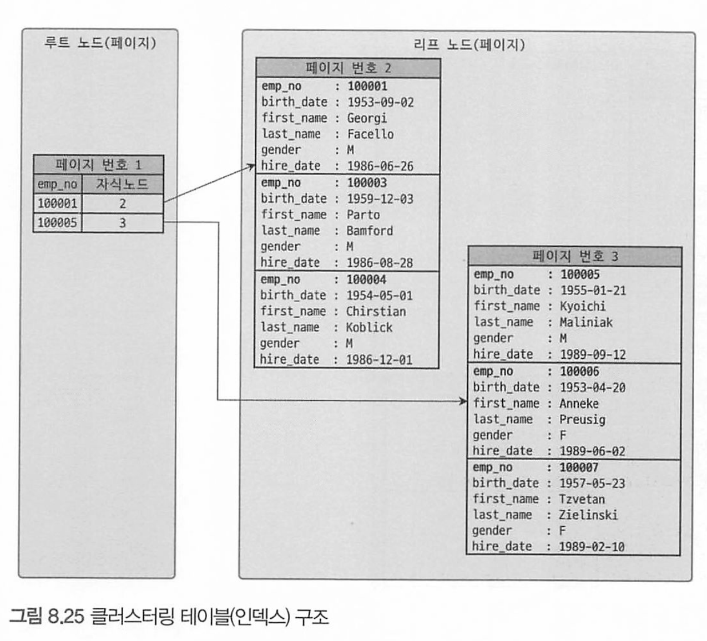

# 8.8 클러스터링 인덱스

MySQL 클러스터링 인덱스는 InnoDB 엔진에서만 지원한다

## 클러스터링 인덱스.

테이블의 PK에 대해서만 적용되는 내용이다

PK 값이 비슷한 레코드끼리 묶어서 저장하는 것을 클러스터링 인덱스라고 한다.

* 중요한것은 프라이머리 키 값에 의해 레코드의 저장 위치가 결정된다.

또한 PK 값이 변경되면, 레코드의 물리적인 저장 위치도 바뀐다.

> MySQL 서버에서 인덱스(index)와 키(key)는 동의어로 사용된다. 그래서 클러스터링 인덱스는 클러스터링 키라고도 한다.

일반적으로 B-Tree 인덱스도 인덱스 키 값으로 정렬되어 저장되지만, 

테이블의 레코드가 PK값으로 정렬되어 저장된 경우만 클러스터링 인덱스라고 한다.



테이블 구조 자체는 B-Tree랑 비슷하지만, B-Tree 리프노드와는 달리 클러스터링 인덱스의 리프노드에는 모든 칼럼이 같이 저장되어있다.

즉 클러스터링 테이블은 그 자체가 하나의 거대한 인덱스 구조로 관리된다.

### PK가 없는 InnoDB 테이블의 클러스터링 구조

프라이머리 키가 없는 경우에는 InnoDB 스토리지 엔진이 다음 우선순위대로 프라이머리 키를 대체할 칼럼을 선 택한다.

1. 프라이머리 키가 있으면 기본적으로 프라이머리 키를 클러스터링 키로 선택
2. NOT NULL 옵션의 유니크 인덱스(UNIQUE INDEX) 중에서 첫 번째 인덱스를 클러스터링 키로 선택
3. 자동으로 유니크한 값을 가지도록 증가되는 칼럼을 내부적으로 추가한 후, 클러스터링 키로 선택

자동으로 추가된 프라이머리 키(일련번호 컬럼)는 사용자에게 노출되지 않으며, 쿼리 문장에 명시적으로 사용할 수 없다

## 세컨더리 인덱스에 미치는 영향

클러스터링 되지 않은 테이블(MyISAM, MEMORY)은 프라이머리 키나 세컨더리 인덱스의 각 키는

내부적으로 레코드를 가리키는 ROWID를 이용해 실제 데이터 레코드를 찾아온다.

때문에 MyISAM이나 MEMORY 테이블에서의 프라이머리 키나 세컨더리 인덱스는 구조적으로 아무 차이가 없다.

**그렇다면 InnoDB에서 세컨더리 인덱스가 실제 레코드가 저장된 주소를 가지고 있다면?**

클러스터링 키 값이 변경될때마다 데이터 레코드의 주소가 변경되고,  해당 테이블의 모든 인덱스에 주솟값(ROWID)를 바꿔야 하므로 엄청난 오버헤드를 일으킬것이다.


`때문에 InnoDB테이블( 클러스터링 테이블)의 모든 세컨더리 인덱스에 해당 레코드 저장된 주소가 아닌 PK 값을 저장하도록 구현되어 있다.`

```mysql
SELECT * FROM employees WHERE first name='Aamer'
```

- MySAM: ix_ firstname 인덱스를 검색해서 레코드의 주소를 확인한 후, 레코드의 주소를 이용해 최종 레코드를 가 져옴
- InnoDB: ix_firstname 인덱스를 검색해 레코드의 프라이머리 키 값을 확인한 후, 프라이머리 키 인덱스를 검색해 서 최종 레코드를 가져옴

## 클러스터링 인덱스의 장점과 단점

| 구분 | 설명                                                         |
| ---- | ------------------------------------------------------------ |
| 장점 | • 프라이머리 키(클러스터링 키)로 검색할 때 처리 성능이 매우 빠름(특히, 프라이머리 키를 범위 검색하는 경우 매우 빠름)<br>• 테이블의 모든 세컨더리 인덱스가 프라이머리 키를 가지고 있기 때문에 인덱스만으로 처리될 수 있는 경우가 많음(이를 커버링 인덱스라고 한다. |
| 단점 | • 테이블의 모든 세컨더리 인덱스가 클러스터링 키를 갖기 때문에 클러스터링 키 값의 크기가 클 경우 전체적으로 인덱스의 크기가 커짐<br>• 세컨더리 인덱스를 통해 검색할 때 프라이머리 키로 다시 한번 검색해야 하므로 처리 성능이 느림<br>• INSERT할 때 프라이머리 키에 의해 레코드의 저장 위치가 결정되기 때문에 처리 성능이 느림<br>• 프라이머리 키를 변경할 때 레코드를 DELETE하고 INSERT하는 작업이 필요하기 때문에 처리 성능이 느림 |

즉 대부분 장점은 빠른 SELECT이며, 단점은 느린 UPDATE, DELETE< INSERT 이다.

일반적 웹 서비스와 같은 OLTP 환경은 쓰기 읽기 비율이 2:8 또는 1:9 이기 때문에 조금 느린 쓰기를 감수하고 읽기를 빠르게 유지하는 것은 중요하다


## 클러스터링 테이블 사용시 주의사항

### 클러스터링 인덱스의 크기

클러스터링 테이블의 경우 모든 세컨더리 인덱스가 PK(클러스터링 키)를 포함하므로 PK의 크기가 커지면 세컨더리 인덱스도 자동으로 커진다. 

5개의 세컨더리 인덱스를 가지는 테이블의 프라이머리 키가 10바이트인 경우와 50바이트인 경우를 비교해보자

| 프라이머리 키 크기 | 레코드당 증가하는 인덱스 크기 | 100만 건 레코드 저장 시 증가하는 인덱스 크기 |
| ------------------ | ----------------------------- | -------------------------------------------- |
| 10바이트           | 10바이트 * 5 = 50바이트       | 50바이트 * 1,000,000 = 47MB                  |
| 50바이트           | 50바이트 * 5 = 250바이트      | 250바이트 * 1,000,000 = 238MB                |

100만건만 돼도 인덱스 크기가 거의 200메가, 천만건이 되면 1.9GB가 증가한다.

인덱스가 커질수록 성능을 내기 위해 그만큼의 메모리가 더 필요해지므로 InnoDB 프라이머리 키는 신중하게 선택한다

### 프라이머리 키는 AUTO-INCREMENT보다는 업무적인 컬럼으로 생성하자

InnoDB의 프라이머리 키는 클러스터링 키로 사용되며, 이 값에 의해 레코드 의 위치가 결정된다. 

즉, 프라이머리 키로 검색하는 경우(특히 범위로 많은 레코드를 검색하는 경우)

클러스터링되지 않은 테이블에 비해 매우 빠르게 처리될 수 있음을 의미한다

프라이머리 키는 그 의미만큼이나 중요한 역할을 하기 때문에 `대부분 검색에서 상당히 빈번하게 사용되는 것이 일반적이다`. 

그러므로 설령 `PK의 크기가 크더라도` `업무적으로 해당 레코드를 대표할 수 있다`면 그 칼럼을 프라이머리 키로 설정하는 것이 좋다.

### 프라이머리 키는 반드시 명시할것

InnoDB 테이블에서 PK를 명시하지 않으면 InnoDB 엔진이 내부적으로 일련번호 칼럼을 추가하는데

이는 접근(사용)할수없으므로 정의하지 않을빠에 AUTO_INCREMENTfㅡㄹ 사용하자

또한 ROW 기반의 복제나 InnoDB Cluster에서는 모든 테이블이 프라이머 리 키를 가져야만 하는 정상적인 복제 성능을 보장하기도 하므로 프라이머리 키는 꼭 생성하자.


**AUTO-INCREMENT 컬럼을 인조 식별자(대리, 대체키)로 사용할 경우**

세컨더리 인덱스도 필요하도 프라이머리 키 길이도 길다면 AUTO_INCREMENT를 사용해서 프라이머리 키로 설정하자

이를 surrogate key라고 하며 로그 테이블과 같이 조회보다는 INSERT위주로 쓰인다면 성능 향상에 도움이 된다. 

# 8.9 유니크 인덱스

유니크는 사실 인덱스라기보다는 제약 조건에 가깝다고 볼 수 있다. 말 그대로 테이블이나 인덱스에 같 은 값이 2개 이상 저장될 수 없음을 의미하는데, MySQL에서는 인덱스 없이 유니크 제약만 설정할 방법이 없다.

NULL은 특정 값이 아니므로 2개이상 저장 될 수 없다.

* MyISAM에서 PK는 사실 NULL허용하지 않는 유니크 인덱스와 같지만 InnoDB 테이블의 프라이머리 키는 클러스터링 키이므로 근본적으로 다르다.

>  InnoDB에서는 프라이머리 키가 레코드의 물리적인 저장 순서를 결정하는 클러스터링 키로서 작동하니까 그렇다

## 유니크 인덱스와 일반 세컨더리 인덱스와 비교

유니크 인덱스와 세컨더리 인덱스의 읽기 쓰기 성능관점에서 보자

### 인덱스 읽기

유니크 인덱스가 빠르다는건 사실이 아니다.

유니크하지 않은 세컨더리 인덱스에서 한 번 더 해야 하는 작업 은 디스크 읽기가 아니라 CPU에서 칼럼값을 비교하는 작업이기 때문에 이는 성능상 영향이 거의 없다 고 볼 수 있다.

`유니크하지 않은 세컨더리 인덱스는 중복된 값이 허용되므로 읽어야 할 레코드가 많아서 느린것이지 인덱스 자체의 특성때문에 느린것이 아니다.`

* 즉 레코드 한건을 읽는데 0.1초가 걸렸고 두건을 읽는데 0.2초가 걸렸다고 했을때 후자를 느리다고 할 수 없는것과 같은이치

몇개의 레코드를 읽어야 하느냐의 차이만 있을뿐 읽어야할 레코드 수가 같다면 성능상 차이는 미미하다

### 인덱스 쓰기

유니크 인덱스 값을 쓸때는 중복된 값이 있는지 체크하는 과정이 필요하므로 세컨더리 인덱스의 쓰기보다 느리다.

`그런데 MySQL 유니크 인덱스에서 중복된 값 체크시에는 읽기 잠금(s-lock)을 사용하고 쓰기를 할때는 쓰기 잠금(x-lock을 사용하는데`

`이 과정에서 데드락이 아주 빈번히 발생한다. `

또한 InnoDB에서는 인덱스 키의 저장을 버퍼링하기 위해 change Buffer가 사용되는데, 인덱스 저장이나 변경시 유니크 인덱스는 작업 자체를 버퍼링하지 못하므로 변경 작업이 더 느리다.

* 즉시 확인하고 즉시 써야되므로 버퍼링을 못한다

> Change Buffer는 MySQL이 인덱스 페이지를 변경할 필요가 있을 때마다 디스크에 즉시 쓰지 않고, 대신 변경 내용을 버퍼에 보관하는것. 이렇게 하면 디스크 쓰기 작업의 수를 줄일 수 있으며, 시스템의 전반적인 성능을 향상시킬 수 있다


## 유니크 인덱스 사용 시 주의사항

MySQL 유니크 인덱스는 일반 다른 인덱스와 같은 역할을 하므로 중복해서 세컨더리 인덱스를 생성할 필요는 없다.

똑같은 칼럼에 대해 프라이머리 키와 유니크 인덱스를 동일하게 생성한 경우도 있는데, 이 또한 불필요한 중복이다.

즉 유일성이 꼭 보장돼야 하는 컬럼에만 유니크 인덱스를 사용하자

# 8.10 외래키

InnoDB 엔진에서만 외래키를 지원한다.

외래키 제약이 설정되면 자동으로 연관되는 테이블의 컬럼에 인덱스까지 생성된다.

InnoDB의 외래키 관리에는 중요한 두 가지 특징이 있다.

- 테이블의 변경(쓰기 잠금)이 발생하는 경우에만 잠금 경합(잠금 대기)이 발생한다.
- 외래키와 연관되지 않은 칼럼의 변경은 최대한 잠금 경합(잠금 대기)을 발생시키지 않는다.

예제 테이블로 언제 자식 테이블의 변경이 잠금 대기를 하고, 언제 부모 테이블의 변경이 잠금대기를 하는지 예제로 보자

```mysql
CREATE TABLE tb_ parent(
	id INT NOT NULL,
	fd VARCHAR (100) NOT NULL, PRIMARY KEY (id)
) ENGINE=InnoDB;

CREATE TABLE tb child (
	id INT NOT NULL,
	pid INT DEFAULT NULL, --// parent.id 칼럼 참조
	fd VARCHAR (100) DEFAULT NULL, 
  PRIMARY KEY (id),
	KEY ix_parentid (pid),
	CONSTRAINT child_ibfk_1 FOREIGN KEY (pid) REFERENCES tb_parent(id) ON DELETE CASCADE
) ENGINE=InnoDB;
```

### 자식 테이블의 변경이 대기하는 경우

```
+-----------+----------------------------------+------------------------------------------+
| 작업 번호 | 커넥션 1                           | 커넥션 2                                 |
+-----------+----------------------------------+------------------------------------------+
| 1         | BEGIN;                            |                                          |
| 2         | UPDATE tb parent                  |                                          |
|           | SET fd=' changed-2' WHERE id=2;   |                                          |
| 3         |                                   | BEGIN;                                   |
| 4         |                                   | UPDATE tb child                          |
|           |                                   | SET pid=2 WHERE id=100;                  |
| 5         |                                   | Query OK, 1 row affected (3.04 sec)       |
| 6         | ROLLBACK;                         |                                          |
+-----------+----------------------------------+------------------------------------------+

```

* 1번 커넥션에서 먼저 트랜잭션 시작 후 부모 테이블에서 id 2인 레코드에 업데이트 실행
* 1번 커넥션이 id = 2 레코드에 쓰기 잠금(x-lock) 획득
* 2번 커넥션에서 자식 테이블의 pid = 2(외래키)로 업데이트 쿼리 실행
* 이 쿼리는(작업번호4번) 부모 테이블의 id = 2 업데이트 쿼리가 끝날때까지 대기한다.

즉 자식 테이블의 외래 키 칼럼 변경(INSERT, UPDATE)는 부모 테이블 확인이 필요한데 이상태에서 부모 테이블 레코드가 쓰기 잠금이 걸려있으면 쓰기 잠금 해제될때가지 무한정 대기한다.

> 즉 부모 테이블 업데이트 시 x-lock이 걸리며 자식 테이블의 pk 업데이트 시에도 부모 테이블에 작업을 대기한다.

또한 자식 테이블의 외래키(parent_id)가 아닌 컬럼의 변경은 외래키로 인한 잠금이 발생하지 않는다. 

### 부모 테이블의 변경 작업이 대기하는 경우

```
+-----------+---------------------------------------+----------------------------- +
| 작업 번호 | 커넥션-1                            | 커넥션-2                             |
+-----------+---------------------------------------+------------------------------+
| 1         | BEGIN;                          |                                     |
| 2         | UPDATE tb_child                 |                                     |
|           | SET fd = 'changed-100'          |                                     |
|           | WHERE id = 100;                 |                                     |
| 3         |                                 | BEGIN;                              |
| 4         |                                 | DELETE FROM tb parent               |
|           |                                 | WHERE id=1;                         |
| 5         | ROLLBACK;                       |                                     |
| 6         |                                 | Query OK, 1 row affected (6.09 sec) |
+-----------+---------------------------------+-------------------------------------+
```

* 1번 커넥션에서 부모키 1을 참조하는 자식 테이블(tb_child)의 레코드를를 변경하면 자식 테이블 레코드에 대해 쓰기 잠금(x-lock)을 획득한다 
* 이상태로 2번 커넥션이 부모 테이블(tb_parent)에서 id가 1인 레코드를 삭제하는 경우 이 쿼리(작업번호 4번)은 tb_child 작업이 완료될떄까지 대기해야 한다

> 즉 부모 테이블 업데이트 시 x-lock이 걸리며 자식 테이블이 insert update delete시에 부모 테이블에도 락을 걸게된다. 

데이터베이스에서 외래 키를 물리적으로 생성하려면 이러한 현상으로 인한 잠금 경합까지 고려해 모델링을 진행하는 것이 좋다

잠금이 다른 테이블로 확장되면 쿼리의 동시 처리에 영향을 미친다. 


정리

* MySQL InnoDB는 record(데이터)를 수정할 때에는 항상 x-lock을 건다
* MySQL은 fk가 존재하는 테이블에서 fk를 포함한 record(데이터)를 삽입, 수정, 삭제 하는 경우 제약조건을 확인하기 위해 부모 테이블에 s-lock을 건다.

